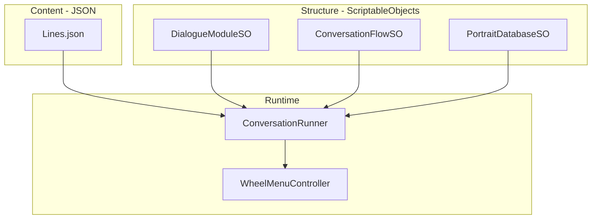

# Dialogue System Data Migration Plan

## Current State

- [WheelMenuController.cs](EsaiRemoteCheckIn/Assets/Scripts/WheelMenuController.cs): Hardcoded nodes, HistoryEntry (nodeId, isShowingResponseLine, entryContext), Node.GetEsaiLine(entryContext)
- Portrait assets in `Art/Portraits/` and `PhotoshopFiles/EsaiPortraitImages/` (e.g. EsaiConcernedSideLookRightPortrait, EsaiDevastatedPortrait, Esai_Excited_3_OfferingHug)
- No Editor scripts; no Lines DB; no ScriptableObjects for dialogue

---

## Target Architecture




---

## Non-Negotiable Implementation Notes (Aethon)

1. **Variants must be Back-safe (no rerolls):** LinesService supports **Select mode** (choose variant, return `(text, selectedVariantId)`) and **Replay mode** (given `selectedVariantId`, return exact same text, no RNG). HistoryEntry stores `selectedVariantId`.
2. **Portraits must be Back-safe:** PortraitResolver returns `(Sprite portrait, PortraitKey resolvedKey)`. HistoryEntry stores `resolvedPortraitKey`; Back reuses it directly (fallback may have downgraded intensity/modifier).
3. **Portraits stay in SO only:** Do not move portraits into JSON yet. PortraitDatabaseSO entries only. Taxonomy is still evolving.
4. **advanceMode early:** Implement exactly `WaitForChoice` (wheel options visible) and `TapToContinue` (no wheel choices, tap/continue beat). Prevents "double OK" weirdness.
5. **Keep ResponseLine / ResponseTextKey:** Options support `nextNodeId` OR `responseTextKey`. If responseTextKey uses variants, store its `selectedVariantId` in History so Back does not reroll.
6. **Validator extra checks:** Missing option label keys (when labelKey is used); Portrait coverage report (warn-only) for missing Mood/Intensity/Modifier combos.
7. **JSON location:** Resources is fine for MVP. StreamingAssets preferred long-term: `Assets/StreamingAssets/Dialogue/Lines.json`. Choose intentionally.
8. **Implementation target:** Phase 1 + Phase 2 = working loop where Holiday can add 50 lines by editing JSON only; Back restores exact line variant + exact resolved portrait; Validator catches missing keys. Then migrate one branch/module as proof.

---

## Phase 1: Lines DB + textKey (keep hardcoded flow)

**Goal:** Introduce `Lines.json` and `LinesService`; nodes reference `textKey` but fall back to inline strings.

### 1.1 Create Lines.json schema

- Path: `Assets/Resources/Dialogue/Lines.json` (Resources for runtime load)
- Schema per Aethon:

```json
{
  "root.greeting": {
    "variants": [
      { "text": "Hey... come here a second. How are you, really?", "weight": 1 }
    ]
  },
  "reassure.general": {
    "variants": [
      { "text": "You're okay. You don't have to solve everything today...", "weight": 1 },
      { "text": "You don't need to earn rest...", "weight": 1 }
    ],
    "rules": { "noRepeatWindow": 5 }
  }
}
```

### 1.2 LinesService (runtime) — two modes, no rerolls

- **Select mode:** `(string text, int selectedVariantId) GetLine(string textKey, string entryContext = null)` — choose variant (weighted / no-repeat), return text + selectedVariantId. No RNG on replay.
- **Replay mode:** `string GetLineReplay(string textKey, int selectedVariantId)` — return exact same text for that variant. No reroll.
- Fallback: if key missing → `MISSING_TEXTKEY: {textKey}` in dev, generic fallback in release
- Optional: `Dictionary<string, Queue<int>>` for noRepeatWindow by key

### 1.3 Extend Node model (in code)

- Add `textKey: string` to Node; keep `EsaiLine` as fallback for migration
- `GetEsaiLine(entryContext)` → if textKey set, call LinesService; else use EsaiLine
- For MVP: build initial Lines.json with all current node textKeys; migrate one node at a time

### 1.4 Extend HistoryEntry

- Add `SelectedVariantId: int` (or string GUID if variants get IDs)
- When Back restores: pass selectedVariantId to LinesService so it returns the same variant (not a new random pick)

### 1.5 Option labelKey (optional in Phase 1)

- Add `labelKey` to Option; keep `Label` as fallback
- Lines.json can have `labels.thanks` etc.

### 1.6 advanceMode (implement early)

- `WaitForChoice` — wheel options visible (current behavior)
- `TapToContinue` — no wheel choices; tap/continue advances to next node. Prevents "double OK" weirdness; makes beat nodes intentional.

### 1.7 ResponseTextKey / ResponseLine

- Options support `nextNodeId` OR `responseTextKey` (display response without leaving node).
- If responseTextKey uses variants, store selectedVariantId in History for that response so Back does not reroll.

---

## Phase 2: Portrait System

**Goal:** Add PortraitRequest per node; PortraitDatabaseSO with Mood x Intensity x Modifier lookup and fallback chain.

### 2.1 PortraitRequest struct

```csharp
struct PortraitRequest {
  Mood mood;      // enum: Neutral, Friendly, Concerned, Firm, Sad, ...
  int intensity;  // 0-4
  Modifier modifier;  // enum: Default, SideLookLeft, SideLookRight, ...
}
```

### 2.2 PortraitKey + PortraitDatabaseSO

- ScriptableObject `PortraitDatabaseSO` with list of `PortraitEntry { PortraitKey, Sprite }`. **Portraits stay in SO only** — no JSON portraits; taxonomy is evolving.
- At runtime build `Dictionary<PortraitKey, Sprite>`
- Fallback search order (per Aethon):
  1. Mood+Intensity+Modifier exact
  2. Mood+Intensity+Default
  3. Mood + nearest intensity (downward)
  4. Mood + 0 + Default
  5. Neutral + 0 + Default

### 2.3 PortraitResolver — returns resolved key for Back

- `PortraitResolver.Resolve(PortraitRequest request)` returns `(Sprite portrait, PortraitKey resolvedKey)`
- Store `resolvedPortraitKey` in HistoryEntry; Back reuses it directly (no re-resolution). Fallback may have downgraded intensity/modifier, so we must store what was actually shown.

### 2.4 Node + PortraitRequest

- Add `PortraitRequest portraitRequest` to Node
- WheelMenuController (or PortraitDisplay) receives resolved sprite and applies to UI Image
- HistoryEntry stores `resolvedPortraitKey` for Back

### 2.5 Portrait assets

- Map existing portrait filenames to Mood/Intensity/Modifier (e.g. EsaiConcernedSideLookRightPortrait → Concerned, 1, SideLookRight)
- Create PortraitDatabaseSO and populate from Art/Portraits

---

## Phase 3: DialogueModuleSO + NodeDef (structure)

**Goal:** Move node structure from code into ScriptableObjects.

### 3.1 NodeDef ScriptableObject

- `nodeId`, `speaker` (Esai/System), `textKey`, `portraitRequest`, `advanceMode` (WaitForChoice / TapToContinue), `options: OptionDef[]`, `triggersEndOverlay`

### 3.2 OptionDef

- `labelKey` or `labelText`, `next` (nodeId), `specialNext` (NEXT_MODULE, HUB, END), `entryContext`, `responseTextKey` (for ResponseLine-style options)

### 3.3 DialogueModuleSO

- `moduleId`, `entryNodeId`, `List<NodeDef>` or `NodeDef[]`
- Builds runtime `Dictionary<nodeId, NodeDef>` for the module

### 3.4 Migration strategy

- Keep `BuildNodes()` that constructs from hardcoded data
- Add `LoadFromModule(DialogueModuleSO module)` path
- Feature flag or config: use hardcoded vs module for check-in flow
- Gradual: migrate one branch (e.g. grounding) to Module SO first

---

## Phase 4: ConversationFlowSO + ConversationRunner

**Goal:** Multi-module flow with NEXT_MODULE support.

### 4.1 ConversationFlowSO

- `flowId`, `DialogueModuleSO[]` (ordered), rules (allowRepeat, shuffle, insertClosing)

### 4.2 ConversationRunner

- Loads ConversationFlowSO
- Tracks `currentModuleIndex`
- On option with `specialNext: NEXT_MODULE` → increment index, jump to next module entry node
- Hubs can be a reusable "Hub Module" or global nodes in a shared module

### 4.3 Integration

- WheelMenuController delegates to ConversationRunner for node resolution
- Or: ConversationRunner owns flow; WheelMenuController is UI-only and receives "show node X" commands

---

## Phase 5: Validation Tooling (non-negotiable)

**Goal:** Editor-time validator; expose as `Tools > Esai > Validate Content`.

### 5.1 Validator checks

- Duplicate nodeIds across modules
- Missing `next` targets (nodeId not found)
- Unreachable nodes within a module
- Missing textKeys in Lines DB
- Missing option label keys (when labelKey is used)
- Missing portrait entries (warn only; fallback exists)
- **Portrait coverage report** (warn-only): list which Mood/Intensity/Modifier combos are missing so we can see gaps

### 5.2 Implementation

- Create `Assets/Editor/` folder
- `DialogueContentValidator.cs` — static class with `[MenuItem("Tools/Esai/Validate Content")]`
- Report to Debug.Log or custom EditorWindow with scrollable results

---

## Phase 6: Full JSON Node Graphs (optional, later)

- Move node graphs from Module SOs into JSON (e.g. `nodes.json` per module)
- Module SO references JSON path; loader builds NodeDef at load time
- Lowest priority; only if SO authoring becomes bottleneck

---

## History Integrity (all phases)

HistoryEntry must store and restore:

- `nodeId`
- `entryContext`
- `selectedVariantId` (so Back shows same line)
- `resolvedPortraitKey` (so Back shows same portrait)

---

## File Structure (proposed)

```
Assets/
  Resources/
    Dialogue/
      Lines.json
  ScriptableObjects/
    Dialogue/
      Modules/
        CheckInModule.asset
      PortraitDatabase.asset
  Scripts/
    Dialogue/
      LinesService.cs
      PortraitDatabaseSO.cs
      PortraitRequest.cs
      DialogueModuleSO.cs
      NodeDef.cs (or embedded in Module)
      ConversationFlowSO.cs
      ConversationRunner.cs
    WheelMenuController.cs (refactor to use services)
  Editor/
    DialogueContentValidator.cs
```

---

## Implementation Order


| Phase | Scope                                                                           | Dependencies                 |
| ----- | ------------------------------------------------------------------------------- | ---------------------------- |
| 1     | Lines.json, LinesService, textKey in Node, HistoryEntry.selectedVariantId       | None                         |
| 2     | PortraitRequest, PortraitDatabaseSO, fallback, HistoryEntry.resolvedPortraitKey | Phase 1                      |
| 5     | Validation tooling                                                              | Phase 1 (can start parallel) |
| 3     | DialogueModuleSO, NodeDef, OptionDef                                            | Phase 1                      |
| 4     | ConversationFlowSO, ConversationRunner                                          | Phase 3                      |
| 6     | JSON node graphs                                                                | Phase 4                      |


---

## Acceptance Criteria

- Holiday can add 50 new reassurance lines by editing `Lines.json` only
- Nodes can request a portrait; fallback chain works without breaking
- Back restores: node, entryContext, exact line variant (via selectedVariantId), exact resolved portrait (via resolvedPortraitKey)
- Validator catches missing keys before play mode (`Tools > Esai > Validate Content`)
- Phase 1 + 2 = working loop; then migrate one branch/module as proof

