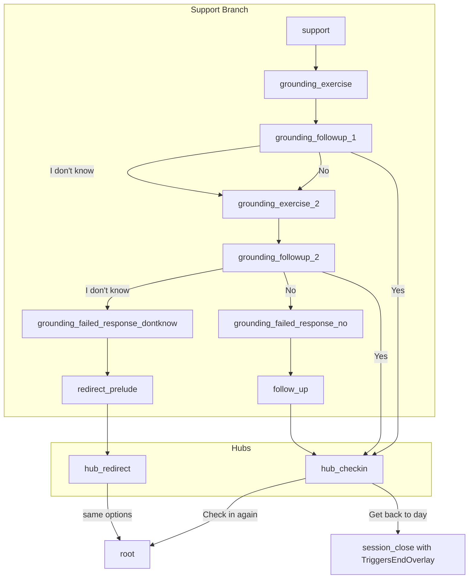

# Esai Dialogue System Development Plan

## Current State

- [WheelMenuController.cs](EsaiRemoteCheckIn/Assets/Scripts/WheelMenuController.cs): Node-based dialogue with `NextNodeId` and `ResponseLine` options. Back button now works correctly for both.
- [PersistentButtonsController.cs](EsaiRemoteCheckIn/Assets/Scripts/PersistentButtonsController.cs): Wires persistent buttons; Back button interactable synced via `CanGoBack`.
- **Problem**: ResponseLine choices dead-end mid-node. No hub, no graceful closing, no entry context.

---

## Target Architecture




---

## Design Commitments (Non-Negotiable)

- **EntryContext in history**: For a comfort/emotional app, Back navigation must restore the correct variant. Tone mismatches ("why did Esai suddenly change his tone?") break immersion. History will store `EntryContext` and Back will restore using it. There is no MVP exception — Back must always restore the same variant the user actually saw.
- **Empty-option nodes**: First-class support. Enables beat pauses, closings, and "Esai says something without demanding input."
- **End overlay as node property**: Use `TriggersEndOverlay = true` on Node, not hardcoded IDs. Reusable for future end nodes. Node IDs should be semantic (e.g. `session_close`, `closing`) — avoid mixing "special node ID" language; behavior comes from the property.

---

## Cursor-Ready Implementation Order

Build in this sequence to get a full conversation loop before expanding content:

1. Add `EntryContext` field to `Option`
2. Add `ShowNode(nodeId, pushHistory, entryContext=null)` + store `currentEntryContext`
3. Replace `Stack<string>` history with `Stack<HistoryEntry>`
4. Update Back to pop `HistoryEntry` and call `ShowNode(entry.nodeId, pushHistory: false, entry.entryContext)`
5. Implement empty-option node support (show text, clear/hide wheel buttons, persistent buttons stay active)
6. Implement hub nodes (`hub_checkin`) + session_close node with `TriggersEndOverlay = true`
7. Wire one existing branch into `hub_checkin` to prove the full loop works

---

## Phase 1: Data Model Extensions

Extend the Option and Node classes to support the new flow.

**1.1 Add EntryContext to Option**

- Add optional `string EntryContext` to `Option` (e.g. `"from_no"`, `"from_dontknow"`).
- When navigating via `NextNodeId`, pass this context into `ShowNode`.

**1.2 Add ShowNode overload with EntryContext**

- Add `ShowNode(string nodeId, bool pushHistory, string entryContext = null)`.
- Store `currentEntryContext` on the controller so context-aware nodes can read it.
- Callers pass `opt.EntryContext` when an option has it.

**1.3 Empty-option nodes (first-class support)**

Explicit controller behavior when `Options == null || Options.Count == 0`:

- Set wheel container inactive (or disable all wheel buttons). Ensure layout doesn't leave dead space.
- Display Esai's line. Leave persistent buttons (Say again, Back, End) active.
- **Do not push history** just because options are empty — history push is tied to navigation events (NextNodeId, ResponseLine), not rendering.
- If `TriggersEndOverlay == true`: call `EndSession()` after rendering text (optionally with a tiny delay for readability).
- Enables: beat pauses, closings, "Esai says something without demanding input."

**1.4 End overlay as node property**

- Add `bool TriggersEndOverlay` to Node. When `true`, after displaying the node text and clearing options, call `EndSession()`.
- Reusable for multiple future end nodes. Avoids brittle hardcoded ID logic.

**1.5 History stack: store nodeId, isShowingResponseLine, entryContext (required)**

- Replace `Stack<string>` with `Stack<HistoryEntry>`:

```csharp
struct HistoryEntry {
  string nodeId;
  bool isShowingResponseLine;
  string entryContext;
}
```

- **When to push:** Push the *state you are leaving* every time the user makes a selection that changes what's shown (NextNodeId navigation OR ResponseLine display).
- **When not to push:** Do not push when `ShowNode` is called as part of Back — keep `pushHistory: false` ironclad.
- When Back: pop `HistoryEntry`, restore with `ShowNode(entry.nodeId, pushHistory: false, entry.entryContext)`.

---

## Phase 2: Hub and Closing Flow

Implement the core hub and closing path.

**2.1 hub_checkin node**

- Esai: "Where would you like to go from here?"
- Options: "Check in again" (→ root), "I'll get back to the day" (→ `session_close` node with `TriggersEndOverlay = true`), "Something else" — see note below.
- **"Something else"**: Do not loop to hub_checkin forever. Either: (a) disable/hide until other modes exist, or (b) route to a tiny "Coming soon" node that returns to hub. Prevents the option from feeling broken.

**2.2 session_close node**

- Node ID: `session_close` (semantic; behavior from `TriggersEndOverlay`).
- Esai: Closing line (e.g. "Take care of yourself. I'm here whenever you need.").
- No options. Node has `TriggersEndOverlay = true`. Controller shows text, clears options, then displays end overlay.

**2.3 Wire root and support to hub (simplified)**

- For MVP: Route one branch (e.g. "I need support" → support → "Reassurance") to a simple terminal that goes to hub_checkin.
- This proves the hub flow before building the full grounding tree.

---

## Phase 3: Graceful Loop Closing (Grounding Branch)

The looped "grounding_exercise → followup → (yes hub / no try exercise2) → repeat" structure creates a sense of Esai "staying with" the user. (Aethon-approved.)

Replace the grounding ResponseLine dead-end with a proper branch.

**3.1 grounding_exercise node**

- Esai: Grounding script (single placeholder for now).
- Option: "Continue" or similar → grounding_followup_1.

**3.2 grounding_followup_1 and grounding_followup_2 (Approach A)**

- **Approach A (recommended):** Split followup into two nodes. No counters needed; data-driven.
- `grounding_followup_1`: First-time "Do you feel a bit more grounded?" Options: Yes (→ hub_checkin), No (→ grounding_exercise_2 with context `from_no`), I don't know (→ grounding_exercise_2 with context `from_dontknow`).
- `grounding_followup_2`: Second-time same question. Options: Yes (→ hub_checkin), No (→ grounding_failed_response_no), I don't know (→ grounding_failed_response_dontknow).
- Alternative: Approach B (one node + `int groundingAttempts` or visit count). Approach A reduces logic branching inside the controller.

**3.3 grounding_exercise_2 node**

- Single node that reads `currentEntryContext`.
- Placeholder: one Esai line per context (`from_no` vs `from_dontknow`) for now.
- Option: "Continue" → grounding_followup_2 (second-time followup).

**3.4 Update support node**

- Change Grounding option from `ResponseLine` to `NextNodeId: "grounding_exercise"`.

---

## Phase 4: Failed Response Paths and Hub Redirect

Complete the grounding branch with failed-response handling.

**4.1 grounding_failed_response_no**

- Esai: Validation/softer response after second "No".
- Option: "Okay" → follow_up.

**4.2 grounding_failed_response_dontknow**

- Esai: Different validation after second "I don't know" (wrong solution, different approach).
- Option: "Okay" → redirect_prelude.

**4.3 follow_up node**

- Esai: "Where would you like to go from here?" (or similar).
- Option: → hub_checkin.
- Keeps emotional break separate from hub.

**4.4 redirect_prelude node**

- Esai: "Let's try something completely different." (or variant).
- Option: → hub_redirect.

**4.5 hub_redirect node**

- Same options as hub_checkin (Check in again, Get back to the day, Something else).
- Different Esai line / tone. Routes to same targets (root, session_close, placeholder).

**4.6 Back button compatibility**

- History stack stores `(nodeId, isShowingResponseLine, entryContext)` per Phase 1.5. When Back pops a navigation entry, pass `entryContext` into `ShowNode` so the correct variant is restored.

---

## Phase 5: Optional Polish — Bridge Nodes

Once the loop works, add micro "bridge nodes" (e.g. "Okay." / "Let's try something else.") so the conversation doesn't jump abruptly between logic branches. Bridge nodes should usually be **single-option** ("Okay") so they read like conversational beats, not new decisions. The plan already has `redirect_prelude` in Phase 4; this extends the idea to other branch transitions.

---

## Phase 6: Variant System (Future)

Defer until after Phases 1–4 are stable.

- Node: Replace `string EsaiLine` with `List<string> EsaiLineVariants` (or keep EsaiLine for single, add optional Variants).
- At ShowNode: if variants exist, pick one (random, or by `entryContext` when applicable).
- Fallback: if only one variant, use it.

---

## Implementation Order Summary


| Phase | Scope                                                                                      | Files                  |
| ----- | ------------------------------------------------------------------------------------------ | ---------------------- |
| 1     | Data model: EntryContext, empty options, end-overlay node, history stack with entryContext | WheelMenuController.cs |
| 2     | hub_checkin, session_close with TriggersEndOverlay, wire one path to hub                   | WheelMenuController.cs |
| 3     | grounding_exercise, grounding_followup_1/2, grounding_exercise_2                           | WheelMenuController.cs |
| 4     | grounding_failed_*, follow_up, redirect_prelude, hub_redirect                              | WheelMenuController.cs |
| 5     | Optional bridge nodes (polish)                                                             | WheelMenuController.cs |
| 6     | Variant selection (later)                                                                  | WheelMenuController.cs |


---

## Risks and Considerations

- **Back button with entry context**: History stack stores `(nodeId, isShowingResponseLine, entryContext)` so Back restores the correct variant. No "wrong variant on back" behavior.
- **Other branches** (reassurance, one-step, conflict, etc.): Can remain as ResponseLine stubs or be migrated incrementally after grounding works.
- **Scrolling**: Planned for later; long text may wrap or truncate until then.

---

## Out of Scope (For Later)

- ScriptableObjects / JSON data migration
- Text scrolling for long Esai lines
- Other game modes (shooting the breeze, explore topics)
- Real dialogue copy (placeholder text until variant system + data migration)

---

## QA Checklist

### Phase 0: Baseline sanity

- App starts on expected root node (no null refs, no missing UI bindings).
- Wheel buttons render with correct labels for the current node.
- Clicking any option updates EsaiResponseText correctly.

### Phase 1: HistoryEntry + Back (core)

**Setup:** Navigate Root → Node A → Node B.

- Back is **disabled** on the first/root node.
- On Node A and beyond, Back is **enabled**.
- Press Back once: returns exactly **one step** (B → A).
- Press Back again: returns one step (A → Root).
- After using Back, selecting an option behaves normally (no "stuck" states).
- EntryContext is restored correctly after Back (the same variant/line reappears, not a different tone).

### Phase 2: Empty-option nodes

**Setup:** Navigate to a node with `Options == null/0`.

- Wheel options are hidden/disabled (no dead clickable buttons).
- EsaiResponseText still displays.
- Persistent buttons still work (Back, End).
- Back returns to the prior node without errors.

### Phase 3: End overlay trigger

**Setup:** Navigate to a node with `TriggersEndOverlay == true`.

- Node text displays before ending (no instant cut-off).
- Wheel options are cleared/disabled.
- End overlay appears reliably (every time).
- Back behavior is defined and consistent: either Back is disabled during overlay, **or** Back closes overlay and returns to the prior node (pick one rule and keep it).

### Phase 4: Hub loop

**Setup:** Reach `hub_checkin` through any branch.

- "Check in" restarts the check-in flow cleanly.
- "I'll get back to the day" routes to session_close then ends (overlay).
- "Something else" does **not** feel broken: either hidden/disabled until implemented, **or** routes to a "Coming soon" node that returns to hub.

### Phase 5: "No / Don't know" second-time handling (grounding)

**Setup:** Pick grounding → respond "No" twice; repeat with "I don't know" twice.

- Second "No" routes to the correct "second-time" response.
- Second "I don't know" routes to the correct "second-time" response.
- No infinite loops unless intentionally designed.
- Hub is reachable from a "success" followup.

### Regression quick pass (run after any change)

- No missing references in Inspector.
- No new console errors/warnings during a full path: Root → branch → hub → end overlay.
- Back never jumps more than one node.
- Back never changes the tone/variant unexpectedly.

