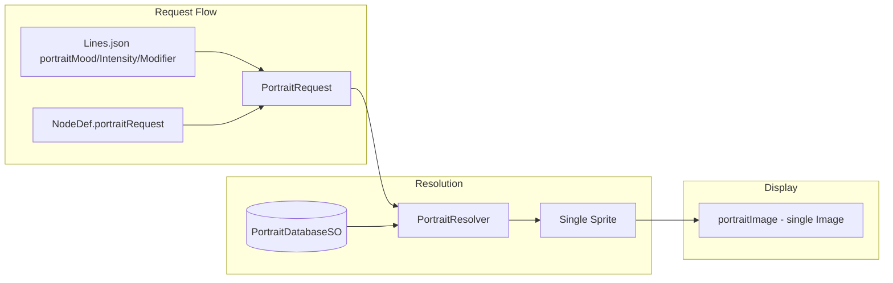
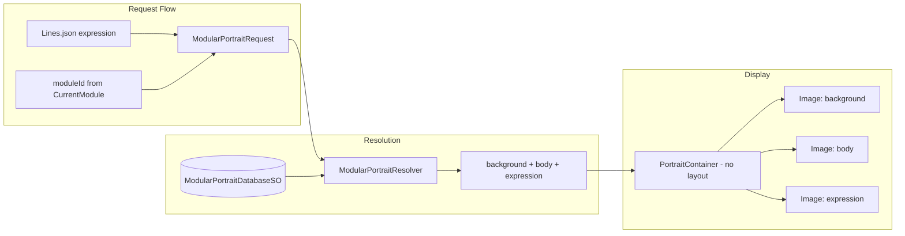

# Modular Portrait System Plan

## Current Architecture




- [PortraitRequest.cs](EsaiRemoteCheckIn/Assets/Scripts/Dialogue/PortraitRequest.cs): mood, intensity, modifier
- [PortraitDatabaseSO.cs](EsaiRemoteCheckIn/Assets/Scripts/Dialogue/PortraitDatabaseSO.cs): `PortraitKey -> single Sprite`
- [PortraitResolver.cs](EsaiRemoteCheckIn/Assets/Scripts/Dialogue/PortraitResolver.cs): returns `(Sprite, PortraitKey)`
- [WheelMenuController.cs](EsaiRemoteCheckIn/Assets/Scripts/WheelMenuController.cs): assigns `portraitImage.sprite` directly

---

## Target Architecture




---

## Implementation Plan

### 1. Data Model: Modular Portrait Database

**New ScriptableObject: `ModularPortraitDatabaseSO**` (or extend `PortraitDatabaseSO`)

Three separate lookup tables:


| Layer      | Key                           | Purpose                                             |
| ---------- | ----------------------------- | --------------------------------------------------- |
| Background | `sceneId` (string)            | e.g. "checkin", "vacation", "kitchen"               |
| Body       | `(sceneId, bodyId)`           | e.g. ("checkin", "default"), ("vacation", "casual") |
| Expression | `(mood, intensity, modifier)` | existing PortraitKey                                |


- **Background entries**: `{ sceneId, sprite }` — one background per scene
- **Body entries**: `{ sceneId, bodyId, sprite }` — body variants per scene (bodyId defaults to "default")
- **Expression entries**: `{ mood, intensity, modifier, sprite }` — face-only crops, same as current but face-only art

Fallback per layer: if "vacation" body missing, try "checkin" body or a "default" body.

### 2. Request Model: Extend PortraitRequest

**Option A (recommended):** Add optional `sceneId` and `bodyId` to a new `ModularPortraitRequest`:

```csharp
public struct ModularPortraitRequest
{
    public string sceneId;      // from module, e.g. "checkin"
    public string bodyId;       // optional, default "default"
    public PortraitMood mood;
    public int intensity;
    public PortraitModifier modifier;
}
```

- `sceneId`: from `ConversationRunner.CurrentModule?.moduleId` (or "default" when no module)
- `bodyId`: optional; add to Lines.json later if needed
- mood/intensity/modifier: unchanged from Lines.json / NodeDef

**Option B:** Keep `PortraitRequest` and add a separate `PortraitContext { sceneId, bodyId }` passed alongside it.

### 3. Resolver: Layered Resolution

**New: `ModularPortraitResolver**`

Returns `(Sprite background, Sprite body, Sprite expression, ModularPortraitKey resolvedKey)`.

- Resolve background: `sceneId` -> sprite, fallback to "default"
- Resolve body: `(sceneId, bodyId)` -> sprite, fallback to (sceneId, "default"), then ("default", "default")
- Resolve expression: same logic as current `PortraitResolver.ResolveWithFallback` (mood/intensity/modifier)

`ModularPortraitKey` stores the resolved sceneId, bodyId, and expression key for Back-safe restore.

### 4. UI: Portrait Container

**New component: `PortraitContainer**` (or `ModularPortraitDisplay`)

- Empty GameObject, **no layout group** (manual layering by sibling order)
- Three child `Image` components, stacked back-to-front:
  1. Background (bottom)
  2. Body (middle)
  3. Expression (top)

All three use the same rect dimensions and anchor (e.g. stretch to fill parent). Art must be authored so layers align when stacked.

```csharp
public class PortraitContainer : MonoBehaviour
{
    [SerializeField] private Image backgroundImage;
    [SerializeField] private Image bodyImage;
    [SerializeField] private Image expressionImage;

    public void SetPortrait(Sprite background, Sprite body, Sprite expression) { ... }
}
```

### 5. Lines.json and Module Changes

**Lines.json:** No change initially. mood/intensity/modifier continue to drive expression.

**Optional later:** Add `portraitSceneId` or `portraitBodyId` for line-level overrides when a line needs a different scene/body than the module default.

**DialogueModuleSO:** Add optional `portraitSceneId` (defaults to `moduleId` if empty). This lets a module explicitly set its portrait scene (e.g. "checkin" vs "vacation").

### 6. WheelMenuController Integration

- Replace `[SerializeField] private Image portraitImage` with `[SerializeField] private PortraitContainer portraitContainer`
- When resolving: call `ModularPortraitResolver.Resolve(modularRequest)` and pass result to `portraitContainer.SetPortrait(bg, body, expr)`
- **Back restore:** `HistoryEntry` stores `ModularPortraitKey`; resolver has `ResolveByKey(key)` returning the three sprites

### 7. Backward Compatibility

**Option A:** Run both systems in parallel during migration:

- If `ModularPortraitDatabaseSO` is assigned and has data, use modular path
- Else use current single-sprite path (existing `PortraitDatabaseSO`)

**Option B:** Migrate fully to modular. Keep `PortraitDatabaseSO` only for expression layer; add new SOs for background and body.

---

## Art Pipeline Notes

- All layer sprites must share the same dimensions and registration (e.g. face crop aligns with body neckline)
- Expression sprites are face-only; body and background are static per scene/body
- You will need to export face-only crops from existing full portraits (or create new face set) and separate body/background assets

---

## File Changes Summary


| File                                                         | Change                                                                           |
| ------------------------------------------------------------ | -------------------------------------------------------------------------------- |
| New: `ModularPortraitDatabaseSO.cs`                          | ScriptableObject with background, body, expression entry lists                   |
| New: `ModularPortraitResolver.cs`                            | Resolves ModularPortraitRequest to 3 sprites with per-layer fallback             |
| New: `PortraitContainer.cs`                                  | MonoBehaviour with 3 Image refs, `SetPortrait(bg, body, expr)`                   |
| New: `ModularPortraitRequest.cs` (or extend PortraitRequest) | Add sceneId, bodyId                                                              |
| `WheelMenuController.cs`                                     | Use PortraitContainer + ModularPortraitResolver; pass sceneId from CurrentModule |
| `LinesService.cs`                                            | No change (expression from portraitMood/Intensity/Modifier)                      |
| `DialogueModuleSO.cs`                                        | Optional `portraitSceneId` field                                                 |
| Scene/prefab                                                 | Replace single portrait Image with PortraitContainer hierarchy                   |


---

## Migration Path

1. Create `ModularPortraitDatabaseSO`, `ModularPortraitResolver`, `PortraitContainer`
2. Add PortraitContainer to scene (3 child Images, no layout group)
3. Populate database with at least one background, one body, and existing expressions (as face-only crops)
4. Wire WheelMenuController to modular path when database is present
5. Gradually add more scene/body variants