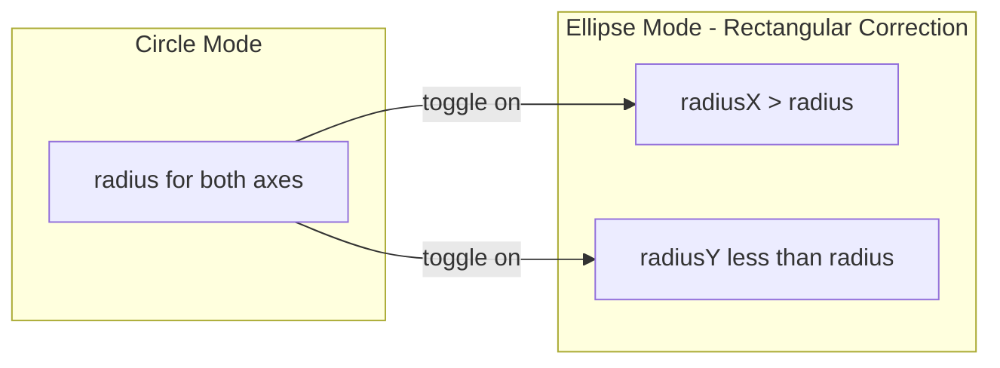

# Radial Layout: Ellipse + Ellipsis

## Goals

1. **Ellipse mode** (RadialLayoutGroup): Use an ellipse instead of a circle so middle buttons spread apart and top/bottom pull in.
2. **Ellipsis truncation** (button prefab): Long labels truncate with "..." instead of affecting layout.
3. **Layout stability** (guard): Radial math must never use child width/preferred size—only geometry (radius, angle, count).

---

## Part 1: Ellipse Mode (RadialLayoutGroup)

**Clarification (Jess):** Ellipse mode stays in the layout. Button *size* drives appearance, not text size.

### Problem

With rectangular buttons (430×100) on a perfect circle:

- **Middle buttons (left/right)** are too close—their centers are at the same Y, and wide buttons can overlap or feel cramped.
- **Top/bottom buttons** appear further from the radius—the button extends beyond its center, so the visual extent feels larger.

### Solution: Ellipse Mode

When enabled, use an **ellipse** instead of a circle:

- **Wider horizontally** → pushes left/right buttons further apart
- **Shorter vertically** → pulls top/bottom buttons toward the center




**Position math change:**

- Circle: `x = radius * cos(θ)`, `y = radius * sin(θ)`
- Ellipse: `x = radiusX * cos(θ)`, `y = radiusY * sin(θ)`

## Implementation

**File:** [Assets/Scripts/UI/RadialLayoutGroup.cs](c:\Users\jessi\Documents\My Games\Games I Made\EsaiRemoteCheckIn\EsaiRemoteCheckIn\Assets\Scripts\UI\RadialLayoutGroup.cs)

### 1. Add serialized fields

```csharp
[SerializeField] private bool useRectangularCorrection;
[SerializeField] [Range(0.8f, 1.5f)] private float horizontalRadiusMultiplier = 1.2f;  // spread left/right
[SerializeField] [Range(0.5f, 1.2f)] private float verticalRadiusMultiplier = 0.85f;   // pull top/bottom in
```

- `useRectangularCorrection`: Toggle. When false, behavior is unchanged (circle).
- `horizontalRadiusMultiplier`: Applied to radius for X. Default 1.2 spreads middle buttons.
- `verticalRadiusMultiplier`: Applied to radius for Y. Default 0.85 pulls top/bottom in.

### 2. Update SetRadial() (lines 69–70)

Compute effective radii before the loop:

```csharp
float radiusX = useRectangularCorrection ? effectiveRadius * horizontalRadiusMultiplier : effectiveRadius;
float radiusY = useRectangularCorrection ? effectiveRadius * verticalRadiusMultiplier : effectiveRadius;
```

Then use `radiusX` and `radiusY` for position:

```csharp
float x = radiusX * Mathf.Cos(angleRad);
float y = radiusY * Mathf.Sin(angleRad);
```

### 3. Update CalculateLayoutInputHorizontal/Vertical (lines 29–39)

Use the same radii so the layout group reports the correct preferred size to parent layouts:

```csharp
float radiusX = useRectangularCorrection ? radius * horizontalRadiusMultiplier : radius;
float radiusY = useRectangularCorrection ? radius * verticalRadiusMultiplier : radius;
// Then use radiusX for horizontal, radiusY for vertical
```

### 4. Add public properties (optional)

For runtime or script access:

```csharp
public bool UseRectangularCorrection { get => useRectangularCorrection; set { useRectangularCorrection = value; SetDirty(); } }
```

## Suggested Defaults


| Setting                    | Value | Effect                  |
| -------------------------- | ----- | ----------------------- |
| useRectangularCorrection   | true  | Enable ellipse mode     |
| horizontalRadiusMultiplier | 1.2   | ~20% wider horizontally |
| verticalRadiusMultiplier   | 0.85  | ~15% shorter vertically |


You can tune these in the Inspector. For stronger separation of middle buttons, increase `horizontalRadiusMultiplier` (e.g. 1.3). For top/bottom closer in, decrease `verticalRadiusMultiplier` (e.g. 0.8).

## Edge Cases

- **Single child (count == 1):** `effectiveRadius` is 0, so `radiusX` and `radiusY` stay 0. No change.
- **rotateChildrenToRadius:** Unchanged; rotation still uses `angleDeg`.

---

## Part 2: Ellipsis Truncation (Button Prefab)

**Goal:** When a label exceeds its space, truncate with "..." so the wheel stays visually stable. Long text must not affect layout.

**File:** [Assets/Prefabs/WheelOptionsButtonPrefab.prefab](c:\Users\jessi\Documents\My Games\Games I Made\EsaiRemoteCheckIn\EsaiRemoteCheckIn\Assets\Prefabs\WheelOptionsButtonPrefab.prefab)

### Change

On the Text (TMP) child component (TextMeshProUGUI), set:

- **Overflow** = `Ellipsis` (currently `0` = Overflow)

In the prefab YAML, the TMP component is around line 258:

```
m_overflowMode: 0   →   m_overflowMode: 1
```

(TMP enum: 0 = Overflow, 1 = Ellipsis)

This keeps truncation at the text level; the layout stays purely positional.

### Optional future enhancements (not in 1.0)

- Tooltip on hover (desktop)
- Long-press reveal (mobile)

---

## Part 3: Layout Guard (No Child Preferred Size)

**Root issue (Aethon):** Long text can "poison" layout if child preferred size influences radial math. The wheel must not expand unpredictably.

### Current behavior (already correct)

[RadialLayoutGroup.cs](c:\Users\jessi\Documents\My Games\Games I Made\EsaiRemoteCheckIn\EsaiRemoteCheckIn\Assets\Scripts\UI\RadialLayoutGroup.cs) already:

- Positions by **geometry only**: `radius`, `angle`, `count`, `childSize` (our serialized value)
- **Drives** child size via `child.sizeDelta = childSize` and `m_Tracker.Add(..., DrivenTransformProperties.SizeDelta)`
- Does **not** read `LayoutUtility.GetPreferredSize` or child `LayoutElement` for positioning

### Verification

- Position math uses `effectiveRadius`, `angleStep`, `childSize`—all from our own fields.
- `CalculateLayoutInputHorizontal/Vertical` use `radius` and `childSize`, not child layout data.
- No changes needed; document this as an invariant for future edits.

